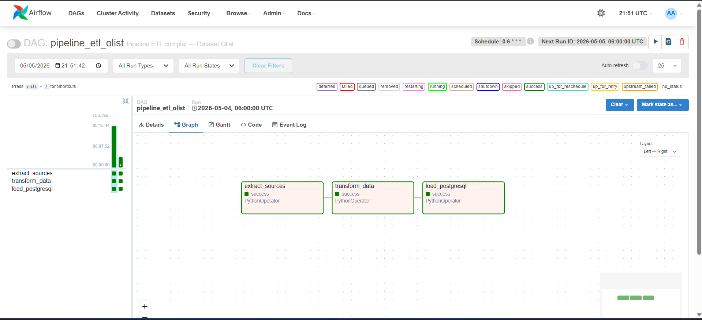
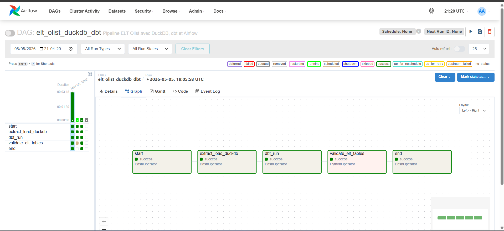

# Projet ETL vs ELT avec Olist Dataset

## Description

Ce projet compare deux approches de traitement de données utilisées en Business Intelligence : **ETL** et **ELT**, à partir du dataset **Brazilian E-Commerce Public Dataset by Olist**.

L’objectif est de construire deux pipelines basés sur le même jeu de données, afin de produire le même modèle analytique final et de comparer les deux approches selon la performance, la maintenabilité, la simplicité et l’intégration avec Power BI.

## Objectifs

- Construire un pipeline ETL avec Python, Pandas, PostgreSQL et Airflow
- Construire un pipeline ELT avec Python, DuckDB et dbt
- Produire le même schéma analytique final pour les deux approches
- Comparer les deux approches selon la performance, la maintenabilité et la simplicité
- Visualiser les résultats avec Power BI

## Stack technique

### ETL


### ELT


### BI


## Dépendances principales


## Installation

Cloner le projet :

```bash
git clone https://github.com/zahiiir1/Projet_etl_elt.git
cd Projet_etl_elt
```

Installer les dépendances Python :

```bash
pip install -r requirements.txt
```

## Structure du projet

```text
Projet_etl_elt/
│
├── Pipeline_ETL/                         # Pipeline ETL avec Python, Pandas, PostgreSQL et Airflow
│   ├── dags/                             # DAG Airflow pour orchestrer le pipeline ETL
│   ├── dataset/                          # Données CSV locales non versionnées
│   ├── logs/                             # Logs locaux non versionnés
│   └── scripts/                          # Scripts Python du pipeline ETL
│
├── Pipeline_ELT/                         # Pipeline ELT avec Python, DuckDB et dbt
│   ├── dataset/                          # Données CSV locales non versionnées
│   ├── exports/                          # Exports éventuels des tables finales
│   ├── logs/                             # Logs locaux non versionnés
│   ├── olist_dbt/                        # Projet dbt pour les transformations SQL
│   │   ├── models/
│   │   │   ├── staging/                  # Vues dbt de nettoyage et standardisation
│   │   │   └── marts/                    # Tables finales dim/fact pour Power BI
│   │   ├── dbt_project.yml               # Configuration principale du projet dbt
│   │   └── README.md                     # Documentation spécifique au projet dbt
│   ├── scripts/                          # Scripts Python du pipeline ELT
│   └── olist_raw.duckdb                  # Base DuckDB locale générée, non versionnée
│
├── powerbi/                              # Fichiers ou captures Power BI
├── docs/                                 # Documentation du projet
├── .env.example                          # Exemple de configuration sans secret
├── .gitignore                            # Fichiers ignorés par Git
├── requirements.txt                      # Dépendances Python du projet
└── README.md                             # Présentation générale du projet
```

## Pipeline ETL

Le pipeline ETL suit l’approche classique :

```text
Extract → Transform → Load
```

Dans cette approche, les données sont extraites depuis les fichiers CSV, transformées avec Python/Pandas, puis chargées dans PostgreSQL.


Flux du pipeline ETL :

```text
CSV → Python/Pandas → PostgreSQL → Power BI
```

Le script principal est :

```text
Pipeline_ETL/scripts/pipeline_etl.py
```

Le pipeline ETL réalise les traitements suivants :

- lecture des fichiers CSV Olist
- conversion des colonnes de dates
- nettoyage des valeurs manquantes
- standardisation des champs texte
- traduction des catégories produits
- agrégation des paiements
- agrégation des avis clients
- création des dimensions
- création des tables de faits
- chargement des tables finales dans PostgreSQL

Une version orchestrée avec Airflow est disponible dans :

```text
Pipeline_ETL/dags/dag_etl_olist.py
```

## Pipeline ELT

Le pipeline ELT suit l’approche suivante :

```text
Extract → Load → Transform
```

Dans cette approche, les données sont d’abord chargées brutes dans DuckDB, puis transformées avec dbt en SQL.


Flux du pipeline ELT :

```text
CSV → DuckDB raw tables → dbt staging views → dbt marts tables → Power BI
```

Le script Extract & Load est :

```text
Pipeline_ELT/scripts/extract_load.py
```

Ce script charge les fichiers CSV bruts dans DuckDB sans transformation.

Les transformations SQL sont réalisées avec dbt dans :

```text
Pipeline_ELT/olist_dbt/
```

Les modèles dbt sont organisés en deux couches :

```text
models/staging/      # Vues intermédiaires : typage, nettoyage et standardisation
models/marts/        # Tables finales analytiques destinées à Power BI
```

## Modèle analytique final

Les deux pipelines produisent le même schéma analytique final afin de garantir une comparaison fiable.

### Dimensions

```text
dim_customer
dim_product
dim_seller
dim_date
```

### Tables de faits

```text
fact_orders
fact_order_items
```

Deux tables de faits sont utilisées car le dataset contient deux niveaux de granularité :

```text
fact_orders       → une ligne par commande
fact_order_items  → une ligne par article commandé
```

Cette séparation évite la duplication des montants de commande lorsqu’une commande contient plusieurs produits.

## Tables finales

Les tables finales utilisées dans Power BI sont :

```text
dim_customer
dim_product
dim_seller
dim_date
fact_orders
fact_order_items
```

Les tables brutes `raw_*` et les vues `stg_*` sont utilisées uniquement dans le pipeline ELT et ne sont pas destinées directement au reporting.

## Exécution du pipeline ETL

Configurer les variables d’environnement à partir du fichier :

```text
.env.example
```

Puis exécuter :

```bash
python Pipeline_ETL/scripts/pipeline_etl.py
```

Pour l’orchestration Airflow, placer le DAG dans le dossier Airflow approprié puis lancer Airflow.

## Exécution du pipeline ELT

Étape 1 : charger les fichiers CSV bruts dans DuckDB.

```bash
python Pipeline_ELT/scripts/extract_load.py
```

Étape 2 : exécuter les transformations dbt.

```bash
cd Pipeline_ELT/olist_dbt
dbt debug
dbt run --full-refresh
```

Résultat attendu :

```text
7 view models
6 table models
Completed successfully
```

## Connexion Power BI

### ETL

Power BI est connecté aux tables finales stockées dans PostgreSQL.

### ELT

Power BI est connecté directement à DuckDB via ODBC.

Tables à charger dans Power BI :

```text
dim_customer
dim_product
dim_seller
dim_date
fact_orders
fact_order_items
```

Relations recommandées :

```text
dim_customer.customer_id  → fact_orders.customer_id
dim_date.date_id          → fact_orders.date_id
fact_orders.order_id      → fact_order_items.order_id
dim_product.product_id    → fact_order_items.product_id
dim_seller.seller_id      → fact_order_items.seller_id
```

## Comparaison ETL vs ELT

| Critère | ETL | ELT |
|---|---|---|
| Principe | Transformer avant chargement | Transformer après chargement |
| Transformation | Python/Pandas | SQL/dbt |
| Stockage final | PostgreSQL | DuckDB |
| Orchestration | Airflow | dbt |
| Traçabilité | Moyenne | Forte grâce aux modèles dbt |
| Maintenabilité | Dépend du code Python | Plus modulaire avec dbt |
| Utilisation BI | Power BI connecté à PostgreSQL | Power BI connecté à DuckDB |

## Fichiers non versionnés

Les fichiers suivants ne sont pas suivis par Git :

```text
.env
dataset/
logs/
exports/
*.duckdb
*.duckdb.wal
*.csv
*.zip
*.docx
.vscode/
```

Ces fichiers sont ignorés car ils peuvent contenir des données locales, des secrets, des fichiers volumineux ou des fichiers générés automatiquement.

## Auteur

Projet réalisé dans le cadre du projet Power BI / Business Intelligence.

```text
Sujet : ETL vs ELT — Étude comparative avec outils open-source
Dataset : Brazilian E-Commerce Public Dataset by Olist
```
